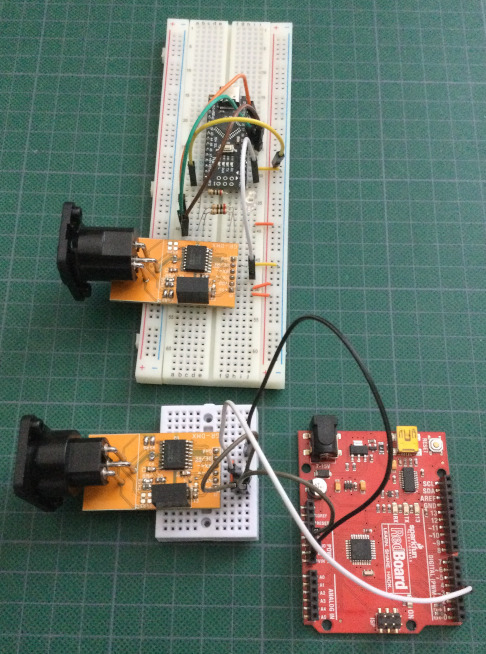

# DMX_Interface
DMX  RS485 to TTL isolated interface
    
The XLR connectors used in the prototype are from Ali Express with part numbers C1019 and C1020 but it can be awkward to search for it on there.   Using a search engine and searching for "C1019 C1020 XLR 3 pin"  may show some Ali Express results that work better than searching directly on the site.
